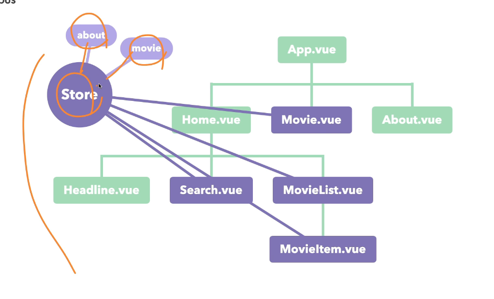

# Vue Router

- install: **npm i vue-router@4**
- 개발 의존성이 아닌 일반 의존성
- main.js 수정( use() 추가)
- src/routes 폴더 추가 | index.js 파일 추가

# bootstrap

- install: **npm i bootstarp**
- src/scss/main.scss에서 부트스트랩 불러오기.

```scss
@import "../../node_modules/bootstrap/scss/bootstrap";
```

- vue-style-loader 4.1.3 버전 error남.

# a태그 대신 RouterLink

# v-model의 $data 접근

- **$data["type"]** < 점 표기법을 사용하는 것과 같음.

# axios

- install: **npm i axios**
- axios.get('주소') 웬만하면 https로 요청.

# async - await

- 함수 앞에 async
- 기다릴 데이터 앞에 await

# Vuex

- 형제 요소에서 데이터를 공유하는 방법은 매우 제한적이다. 그렇기에 중앙집중 저장소인 Vuex를 이용한다.
  
